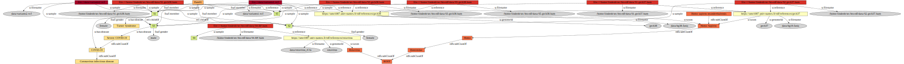

# hts-rdf

Author: Pierre Lindenbaum PhD.


Here are a few notes about Managing  sequencing data with RDF. I want to keep track of the samples, BAMs, references, diseases etc..  used in my lab.

  - I don't want to use a sql database.
  - I don't want to join too many tab delimited files.
  - I want to use a controlled vocabulary to define things like a disease, etc...
  - In this document I won't explain what are `RDF` or `SPARQL`.
  - I use the `RDF+XML` notation because I 'm used to work with `XML`.
  - I create a namespace for my lab:  `https://umr1087.univ-nantes.fr/rdf/` and a `XML` entity for this namespace: `&u1087;`.
  - I tried to reuse existing ontologies (e.g. `foaf:Person` for samples) as much as I can, but sometimes I created my own classes and properties.


# Building the RDF GRAPH

## Species

I manually wrote [data/species.rdf](data/species.rdf) defining the species used in my lab.
We will use `rdf:subClassOf` to find organisms that are a sub-species of a taxon in the NCBI taxonomy tree.

```rdf
(...)

<u:Taxon rdf:about="http://purl.uniprot.org/taxonomy/9606">
	<rdfs:subClassOf rdf:resource="http://purl.uniprot.org/taxonomy/9605"/>
	<dc:title>Homo Sapiens</dc:title>
</u:Taxon>


<u:Taxon rdf:about="http://purl.uniprot.org/taxonomy/9605">
	<rdfs:subClassOf rdf:resource="http://purl.uniprot.org/taxonomy/9604"/>
	<dc:title>Homo</dc:title>
</u:Taxon>

<u:Taxon rdf:about="http://purl.uniprot.org/taxonomy/9604">
	<rdfs:subClassOf rdf:resource="http://purl.uniprot.org/taxonomy/all"/>
	<dc:title>Hominidae</dc:title>
</u:Taxon>


<u:Taxon rdf:about="http://purl.uniprot.org/taxonomy/63221">
	<rdfs:subClassOf rdf:resource="http://purl.uniprot.org/taxonomy/9606"/>
        <dc:title>Homo sapiens neanderthalensis</dc:title>
</u:Taxon>


<u:Taxon rdf:about="http://purl.uniprot.org/taxonomy/10912">
	<rdfs:subClassOf rdf:resource="http://purl.uniprot.org/taxonomy/all"/>
	<dc:title>Rotavirus</dc:title>
</u:Taxon>

<u:Taxon rdf:about="http://purl.uniprot.org/taxonomy/all">
	<dc:title>ROOT</dc:title>
</u:Taxon>


</rdf:RDF>
```


## Diseases

I manually wrote [data/diseases.rdf](data/diseases.rdf) defining the diseases used in my lab.
We will use `rdf:subClassOf` to find organisms that are a sub-disease in a disease ontology tree.

```rdf
(...)
    <owl:Class rdf:about="http://purl.obolibrary.org/obo/DOID_0080599">
        <rdfs:label>Coronavirus infectious disease</rdfs:label>
    </owl:Class>

    <owl:Class rdf:about="http://purl.obolibrary.org/obo/DOID_0080600">
        <rdfs:label>COVID-19</rdfs:label>
	<rdfs:subClassOf rdf:resource="http://purl.obolibrary.org/obo/DOID_0080599"/>
    </owl:Class>

    <owl:Class rdf:about="http://purl.obolibrary.org/obo/DOID_0081013">
	<rdfs:subClassOf rdf:resource="http://purl.obolibrary.org/obo/DOID_0080600"/>
        <rdfs:label>Severe COVID-19</rdfs:label>
    </owl:Class>

    <owl:Class rdf:about="http://purl.obolibrary.org/obo/DOID_3491">
        <rdfs:label>Turner Syndrome</rdfs:label>
    </owl:Class>

</rdf:RDF>
```


## References / FASTA / Genomes

I manually wrote [data/references.tsv](data/references.tsv) a tab delimited text file defining each FASTA reference genome available on my cluster. The taxon id will be used to retrive the species associated to a FASTA file.

```
#path                 genomeId   ucsc  taxid
data/hg19.fasta       grch37     hg19  9606
data/hg38.fasta       grch38     hg38  9606
data/rotavirus_rf.fa  rotavirus        10912
```

using awk, the table is transformed into **RDF**:

```bash
tail -n+2 data/references.tsv |\
	awk -F '\t' '{printf("<u:Reference rdf:about=\"&u1087;references/%s\">\n\t<u:genomeId>%s</u:genomeId>\n\t<u:filename>%s</u:filename>\n",$2,$2,$1);if($4!="") printf("\t<u:taxon rdf:resource=\"http://purl.uniprot.org/taxonomy/%s\"/>\n",$4); printf("</u:Reference>\n");}'
```

output:

```rdf
(...)
<u:Reference rdf:about="&u1087;references/grch37">
	<u:genomeId>grch37</u:genomeId>
	<u:filename>data/hg19.fasta</u:filename>
	<u:taxon rdf:resource="http://purl.uniprot.org/taxonomy/9606"/>
</u:Reference>
<u:Reference rdf:about="&u1087;references/grch38">
	<u:genomeId>grch38</u:genomeId>
	<u:filename>data/hg38.fasta</u:filename>
	<u:taxon rdf:resource="http://purl.uniprot.org/taxonomy/9606"/>
</u:Reference>
<u:Reference rdf:about="&u1087;references/rotavirus">
	<u:genomeId>rotavirus</u:genomeId>
	<u:filename>data/rotavirus_rf.fa</u:filename>
	<u:taxon rdf:resource="http://purl.uniprot.org/taxonomy/10912"/>
</u:Reference>
</rdf:RDF>
```

## Samples


I manually wrote [data/samples.rdf](data/samples.rdf) defining the samples sequenced in my lab.
This is where we can define the gender, associate a sample to a diseases and where we can define the familial relations.
The Class `foaf:Group` is used to create a group of samples.

```rdf
(...)
  <foaf:Person rdf:about="&u1087;samples/S1">
    <foaf:name>S1</foaf:name>
    <foaf:gender>female</foaf:gender>
    <rel:childOf rdf:resource="&u1087;samples/S2"/>
    <rel:childOf rdf:resource="&u1087;samples/S3"/>
    <u:has-disease rdf:resource="http://purl.obolibrary.org/obo/DOID_0080600"/>
    <u:has-disease rdf:resource="http://purl.obolibrary.org/obo/DOID_3491"/>
  </foaf:Person>


  <foaf:Person rdf:about="&u1087;samples/S2">
    <foaf:name>S2</foaf:name>
    <foaf:gender>female</foaf:gender>
  </foaf:Person>


  <foaf:Person rdf:about="&u1087;samples/S3">
    <foaf:name>S3</foaf:name>
    <foaf:gender>male</foaf:gender>
    <u:has-disease rdf:resource="http://purl.obolibrary.org/obo/DOID_0081013"/>
  </foaf:Person>

  <foaf:Group rdf:about="&u1087;groups/family1">
	<foaf:name>Fam01</foaf:name>
	<foaf:member rdf:resource="&u1087;samples/S1"/>
	<foaf:member rdf:resource="&u1087;samples/S2"/>
	<foaf:member rdf:resource="&u1087;samples/S3"/>
	<foaf:member rdf:resource="&u1087;samples/S5"/>
  </foaf:Group>

</rdf:RDF>
```

## BAM files

BAM file contains the sample names in their read-groups; We use `samtools samples` to extract the samples, the reference and the path of each BAM file.
[data/samtools.samples.to.rdf.awk](data/samtools.samples.to.rdf.awk) is used to convert the output of `samtools samples`  to `RDF`.


```bash
find ${PWD}/data -type f -name "*.bam" |\
	samtools samples -F TMP/references.txt |\
	sort -T TMP -t $'\t' -k3,3 |\
	join -t $'\t' -1 3 -2 1 - TMP/sorted.refs.txt > TMP/bams.txt

cat data/header.rdf.part > TMP/bams.rdf

awk -F '\t' -f data/samtools.samples.to.rdf.awk TMP/bams.txt >> TMP/bams.rdf

cat data/footer.rdf.part >> TMP/bams.rdf
```

the output:

```rdf
(...)
  <foaf:Person rdf:about="&u1087;samples/S5">
    <foaf:name>S5</foaf:name>
  </foaf:Person>
  <u:Bam rdf:about="file:///home/lindenb/src/hts-rdf/data/S5.grch38.bam">
    <u:filename>/home/lindenb/src/hts-rdf/data/S5.grch38.bam</u:filename>
    <u:sample rdf:resource="&u1087;samples/S5"/>
    <u:reference rdf:resource="&u1087;references/grch38"/>
  </u:Bam>
(...)
```

## Combining all the RDF chunks

[jena/rio](https://jena.apache.org/) is used to merge `RDF` files into [knowledge.rdf](knowledge.rdf)

```bash
riot --formatted=RDFXML TMP/references.rdf data/species.rdf TMP/bams.rdf data/diseases.rdf data/samples.rdf > knowledge.rdf
```


# Querying the GRAPH

[jena/arq](https://jena.apache.org/) is used to run the `SPARQL` queries.

```bash
arq --data=knowledge.rdf --query=querysparql
```

## Example

> show me the species that are a sub-taxon of "Homo"

query [data/query.species.01.sparql](data/query.species.01.sparql):

```sparql
(...)

SELECT DISTINCT ?taxonName
WHERE {
	?taxon dc:title ?taxonName .
	?taxon a u:Taxon .
	?taxon rdfs:subClassOf* ?root .
	?root a u:Taxon .
	?root dc:title "Homo" .
}
```

output:

```
-----------------------------------
| taxonName                       |
===================================
| "Homo sapiens neanderthalensis" |
| "Homo Sapiens"                  |
| "Homo"                          |
-----------------------------------
```

## Example

> show the diseases that are a sub disease of **COVID-19**.

query [data/query.diseases.01.sparql](data/query.diseases.01.sparql):

```sparql
(...)

SELECT DISTINCT ?diseaseName
WHERE {
	?disease rdfs:label ?diseaseName .
	?disease a owl:Class .
	?disease rdfs:subClassOf* ?root .
	?root a owl:Class .
	?root rdfs:label "COVID-19" .
}
```

output:

```
---------------------
| diseaseName       |
=====================
| "COVID-19"        |
| "Severe COVID-19" |
---------------------
```


## Example

> find the samples , their children, parents , diseases

query [data/query.samples.01.sparql](data/query.samples.01.sparql) :

```sparql
(...)

SELECT DISTINCT
		(SAMPLE(?sampleName) as ?colName)
		(SAMPLE(?gender) as ?colGender )
		(SAMPLE(?fatherName) as ?colFather )
		(SAMPLE(?motherName)  as ?colMother)
		(GROUP_CONCAT(DISTINCT ?childName; SEPARATOR=";") as ?colChildren)
		(GROUP_CONCAT(DISTINCT ?diseaseName; SEPARATOR=";") as ?colDiseases)
		
WHERE {
	?sample a foaf:Person .
	?sample foaf:name ?sampleName .
	OPTIONAL {?sample foaf:gender ?gender .}
	OPTIONAL {
		?sample u:has-disease ?disease .
		?disease a owl:Class .
		?disease rdfs:label ?diseaseName .
		} .
	OPTIONAL {
		?father a foaf:Person .
		?sample rel:childOf ?father .
		?father foaf:gender "male" .
		?father foaf:name ?fatherName .
		} .
	OPTIONAL {
		?mother a foaf:Person .
		?sample rel:childOf ?mother .
		?mother foaf:gender "female" .
		?mother foaf:name ?motherName .
		} .
	OPTIONAL {
		?child a foaf:Person .
		?child rel:childOf ?sample .
		?child foaf:name ?childName .
		} .
}
GROUP BY  ?sample
```

output:

```
------------------------------------------------------------------------------------------
| colName | colGender | colFather | colMother | colChildren | colDiseases                |
==========================================================================================
| "S1"    | "female"  | "S3"      | "S2"      |             | "Turner Syndrome;COVID-19" |
| "S2"    | "female"  |           |           | "S1"        |                            |
| "S3"    | "male"    |           |           | "S1"        | "Severe COVID-19"          |
| "S4"    |           |           |           |             |                            |
| "S5"    |           |           |           |             |                            |
------------------------------------------------------------------------------------------
```


## Example

> find the bam , their reference, samples , etc.. 

query [data/query.bams.01.sparql](data/query.bams.01.sparql) :

```sparql
(...)

SELECT DISTINCT ?bamPath
		(SAMPLE(?fasta) as ?colFasta)
		(SAMPLE(?taxonName) as ?colTaxon)
		(SAMPLE(?sampleName) as ?colSampleName )
		(GROUP_CONCAT(DISTINCT ?groupName; SEPARATOR=";") as ?colGroups )
		(GROUP_CONCAT(DISTINCT ?gender; SEPARATOR=";") as ?colGender )
		(GROUP_CONCAT(DISTINCT ?diseaseName; SEPARATOR=";") as ?colDiseases)
		(SAMPLE(?fatherName) as ?colFather )
		(SAMPLE(?motherName)  as ?colMother)
		(GROUP_CONCAT(DISTINCT ?childName; SEPARATOR="; ") as ?colChildren)
WHERE {
  ?bam a u:Bam .
  ?bam u:filename ?bamPath .
  OPTIONAL {?bam u:sequencing-type ?bamType }.

  OPTIONAL {
	?bam u:reference ?ref .
	?ref a u:Reference .
	?ref u:filename ?fasta

	OPTIONAL {
		?ref u:taxon ?taxon .
		?taxon a u:Taxon .
		?taxon dc:title ?taxonName .
		}
	}

  OPTIONAL {
	?bam u:sample ?sample .
	?sample a foaf:Person .
	OPTIONAL {?sample foaf:name ?sampleName .}
	OPTIONAL {?sample foaf:gender ?gender .}
	OPTIONAL {
		?group foaf:member ?sample .
		?group a foaf:Group .
		?group foaf:name ?groupName .
		} .
	OPTIONAL {
		?sample u:has-disease ?disease .
		?disease a owl:Class .
		?disease rdfs:label ?diseaseName .
		} .
	OPTIONAL {
		?father a foaf:Person .
		?sample rel:childOf ?father .
		?father foaf:gender "male" .
		?father foaf:name ?fatherName .
		} .
	OPTIONAL {
		?mother a foaf:Person .
		?sample rel:childOf ?mother .
		?mother foaf:gender "female" .
		?mother foaf:name ?motherName .
		} .
	OPTIONAL {
		?child a foaf:Person .
		?child rel:childOf ?sample .
		?child foaf:name ?childName .
		} .
	}.
}
GROUP BY  ?bamPath
```

output:

```
-------------------------------------------------------------------------------------------------------------------------------------------------------------------------------------------------------
| bamPath                                        | colFasta               | colTaxon       | colSampleName | colGroups | colGender | colDiseases                | colFather | colMother | colChildren |
=======================================================================================================================================================================================================
| "/home/lindenb/src/hts-rdf/data/S1.grch38.bam" | "data/hg38.fasta"      | "Homo Sapiens" | "S1"          | "Fam01"   | "female"  | "Turner Syndrome;COVID-19" | "S3"      | "S2"      |             |
| "/home/lindenb/src/hts-rdf/data/S2.grch37.bam" | "data/hg19.fasta"      | "Homo Sapiens" | "S2"          | "Fam01"   | "female"  |                            |           |           | "S1"        |
| "/home/lindenb/src/hts-rdf/data/S4.RF.bam"     | "data/rotavirus_rf.fa" | "Rotavirus"    | "S4"          |           |           |                            |           |           |             |
| "/home/lindenb/src/hts-rdf/data/S5.grch38.bam" | "data/hg38.fasta"      | "Homo Sapiens" | "S5"          | "Fam01"   |           |                            |           |           |             |
| "/home/lindenb/src/hts-rdf/data/S3.grch38.bam" | "data/hg38.fasta"      | "Homo Sapiens" | "S3"          | "Fam01"   | "male"    | "Severe COVID-19"          |           |           | "S1"        |
| "/home/lindenb/src/hts-rdf/data/S1.grch37.bam" | "data/hg19.fasta"      | "Homo Sapiens" | "S1"          | "Fam01"   | "female"  | "Turner Syndrome;COVID-19" | "S3"      | "S2"      |             |
-------------------------------------------------------------------------------------------------------------------------------------------------------------------------------------------------------
```


# The Graph

and here is the RDF graph


